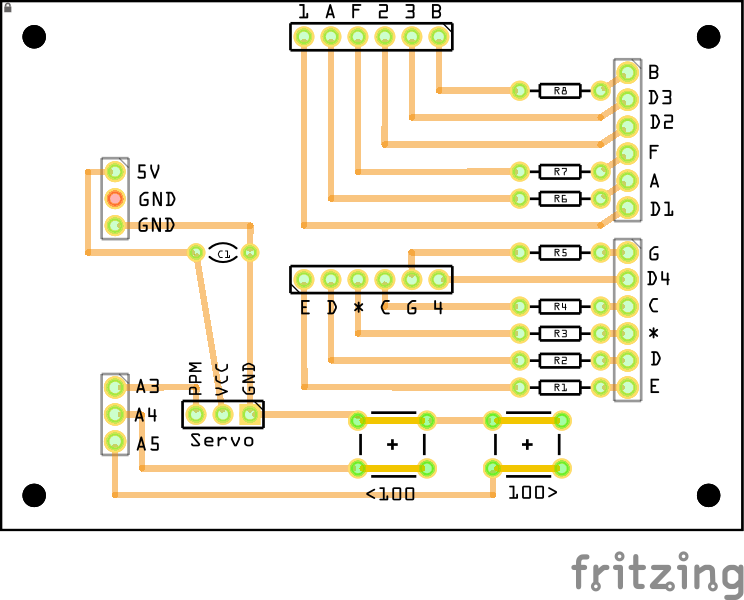

# ServoDriver
A simple tool for positioning a servo using PPM (Pulse Position Modulation)

**ServoDriver** is intended to be a standalone device using a 16x2 LCD to show the current PPM value.

**ServoDriverShield** is an Arduino UNO compatible shield that uses a 4-digit 7-segment display to show the current PPM value. 

