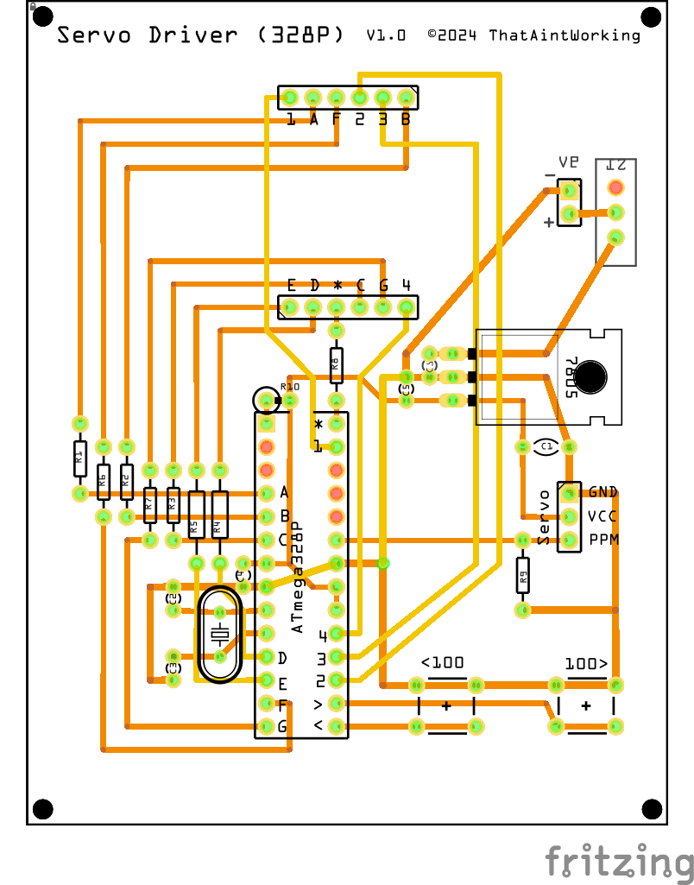

# Servo Driver (328P)

A simple tool for positioning a servo using PPM (Pulse Position Modulation) implemented as a standalone device using an ATmega328P with a 4-digit 7-segment LED display to show the PPM value.

