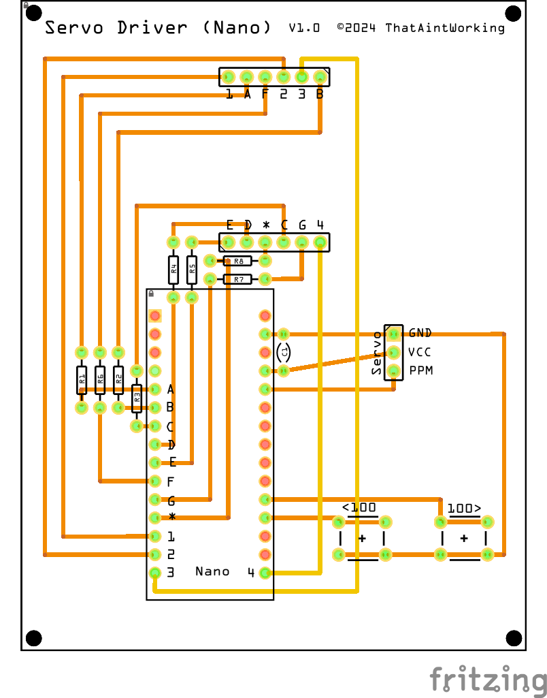

# Servo Driver (Nano)

A simple tool for positioning a servo using PPM (Pulse Position Modulation) implemented as a standalone device using an Arduino Nano with a 4-digit 7-segment LED display to show the PPM value.

