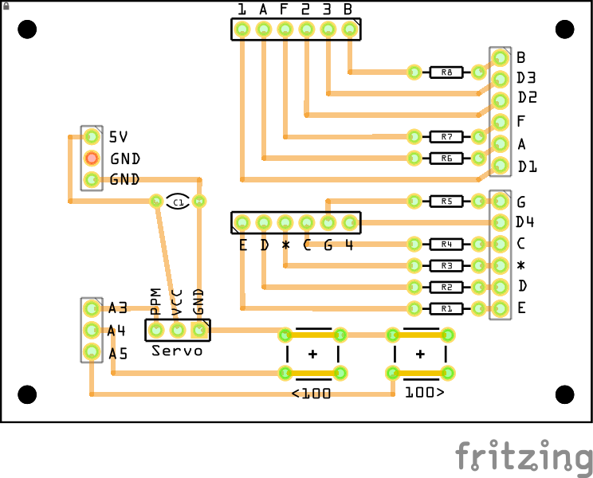

# ServoDriverShield

A simple tool for positioning a servo using PPM (Pulse Position Modulation) implemented as an Arduino UNO compatible shield that uses a 4-digit 7-segment display to show the current PPM value. 

